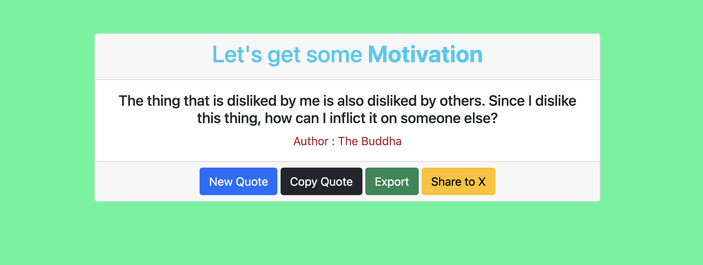

# *MotivationHub*
MotivationHub is a simple web application that displays inspirational quotes to help you stay motivated. The app offers a dynamic way to get a new quote, copy a quote, export it, and even share it on social media.
---
## Demo 

---

## Features
1. Get Motivational Quotes: Display random motivational quotes to inspire you.
2. New Quote: Click a button to generate a fresh quote.
3. Copy Quote: Copy the quote to your clipboard for sharing.
4. Export Quote: Download the current quote as a html file.
4. Share to X: Share the current quote on your social media (X).
---
## Installation
To use this application, follow these steps:

1. Clone the repository

2. Navigate into the project folder:

```bash
cd MotivationHub
```
3. Open the index.html file in your browser to view the application: Simply double-click index.html or open it in any modern web browser.

----
## Files
1. index.html: The main HTML file that contains the structure of the application, including the quote display area and buttons.
2. index.js: JavaScript file that handles fetching quotes, displaying them, and enabling the functionality of the buttons (new quote, copy, export, share).
3. README.md: This file explaining how to set up and use the project.

---
## Usage
- Displaying a New Quote: Click the "New Quote" button to generate a random motivational quote.
- Copying a Quote: Click the "Copy Quote" button to copy the displayed quote to your clipboard.
- Exporting a Quote: Click the "Export" button to download the displayed quote as a text file.
- Sharing a Quote on X: Click the "Share to X" button to share the current quote directly to your social media (X).
---
# Dependencies
1. Bootstrap 5: The project uses Bootstrap 5 for responsive design and styling.
2. JavaScript: The app uses vanila JavaScript to manage the functionality of fetching and interacting with quotes.